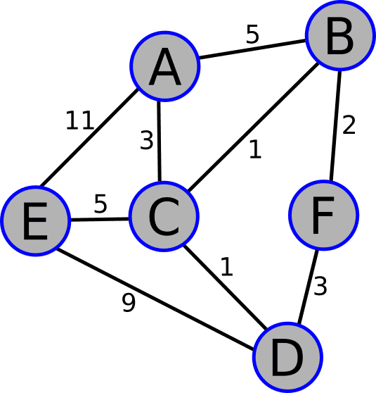

# Pathfinding Lab: Python Shortest Path Visualizer

Welcome to Pathfinding Lab! This project implements Dijkstra's algorithm to calculate the shortest distance between nodes in a weighted graph. You'll explore efficient path tracking using dictionaries, control flow, and edge relaxation; all while constructing one of the most well-known graph traversal techniques.

---

## What This Script Does

- Uses Dijkstra’s algorithm to calculate the shortest path between nodes  
- Accepts weighted, undirected graphs via adjacency lists  
- Tracks both shortest distances and routes using `distances` and `paths` dictionaries  
- Allows optional targeting of a single destination or defaults to all nodes

---

## Graph Used



## What I Learned

### Graph Modeling
- Representing graphs using a dictionary of tuples for weighted edges  
- Using lists to represent visited and unvisited nodes  

### Pathfinding & Logic
- Finding the closest unvisited node with `min()` and dictionary values  
- Applying edge relaxation: checking if a new route is shorter and updating accordingly  
- Maintaining accurate path history using `.extend()` and `.append()`  

### Control Flow & Dictionary Handling
- Using list slicing to copy path data and avoid shared reference issues  
- Conditional dictionary comprehensions to initialize distances efficiently  
- Preventing index errors by checking for empty lists before accessing elements

---

## How to Use

1. Clone or download this repository  
2. Open the script in a Python 3 environment  
3. Call the function with:

---

## Example Output

```python
shortest_path(my_graph, 'A', 'F')
```

---
## Test Paths You Can Explore
```python
shortest_path(my_graph, 'A', 'B')  # Expected: A -> C -> B (distance: 4)
shortest_path(my_graph, 'A', 'C')  # Expected: A -> C (distance: 3)
shortest_path(my_graph, 'A', 'D')  # Expected: A -> C -> D (distance: 4)
shortest_path(my_graph, 'A', 'E')  # Expected: A -> C -> E (distance: 8)
shortest_path(my_graph, 'A', 'F')  # Expected: A -> C -> B -> F (distance: 6)
```

---

## Next Steps (Ideas to Explore)
- Add cycle detection or support for directed graphs
- Use heapq for more efficient node selection
- Add visualization (e.g. with networkx or matplotlib)
- Extend the algorithm to handle dynamic graphs or edge updates

Whether you're studying graph theory or solving real-world routing problems, this lab gives you a practical and modular springboard for algorithmic thinking. Keep building!